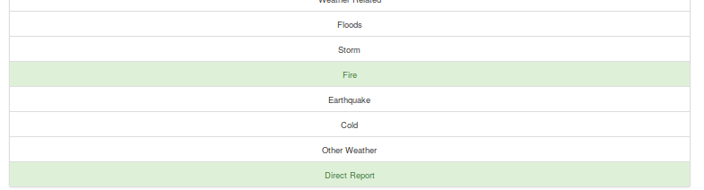

<html>
<h1>How are messages clssified during a disaster?</h1>

<h1>Table of Contents</h1>
<pre>
<a href="#Description">Description</a> 	
<a href="#Installation">Installation</a>
<a href="#Project Motivation">Project Motivation</a>
<a href="#File Description">File Description</a>
<a href="#Execution">Execution</a>
<a href="#Results">Results</a>
<a href="#Licensing">Licensing</a>
<a href="Acknowledgements">Acknowledgements</a>
</pre>

<h1>Description</h1>
<pre>
This Project is part of Data Science Nanodegree Program by Udacity in collaboration with Figure Eight.
The  dataset contains pre-labelled tweets and messages from real-life disaster. 
The aim of the project is to build a NLP tool an ML pipeline  that categorize messages and displays in the web app.

The Project is divided in the following Sections:

1. Data Pre-processing, ETL Pipeline to extract data from source, clean data and save them in a proper database. 
2. Machine Learning Pipeline to train a model that is able to classify text messages into categories
3. Web App to show model results in real time. 
	

</pre>
	

<h1>Installation</h1>

You are supposed to use this command for downloading this files into 
"git clone https://github.com/saiharshithkumarsiguru/disaster_response/"  
<pre>
The following libabries are to be installed

* Python 3
* Machine Learning Libraries: NumPy, SciPy, Pandas, Sciki-Learn
* Natural Language Process Libraries: NLTK
* SQLlite Database Libraqries: SQLalchemy
* Web App and Data Visualization: Flask, Plotly

</pre>

<h1>Project Motivation</h1>
<pre>

It's really important that our emergency calls are responded and help is sent out fast.
Inorder to achieve this,the messages are to be devided according to the respective departments.
Yah You guessed it right!This project does that.    

</pre>

<h1>File Description</h1>

<pre>
App:
 This folder has the following files:

 1. Templates:It has the go.html file and master.html files.
 2. run.py

</pre>
<pre>
Data:
This folder has the following files:

1. disaster_categories.csv: This is the categories data file.
2. disaster_response.csv: This has the messages data in it.
3. DisasterResponse: This is our database.
4. process_data.py: This is the pre-processing file.  	
</pre>
<pre>
models:
This folder has the following files:

1. classifier.pkl: This is the pickle file that stored our model.
2. train_classifier.py: This is our model file.

</pre>
<pre>
screenshots:
This file has input and output images.	
</pre>

<pre>
1. Run the following commands in the project's root directory to set up your database and model.

    - To run ETL pipeline that cleans data and stores in database
        `python data/process_data.py data/disaster_messages.csv data/disaster_categories.csv data/DisasterResponse.db`
    - To run ML pipeline that trains classifier and saves
        `python models/train_classifier.py data/DisasterResponse.db models/classifier.pkl`

2. Run the following command in the app's directory to run your web app.
    `python run.py`

3. Go to http://0.0.0.0:3001/

</pre>

<h1>Results</h1>
1. Input Message

2. After clicking **Classify Message**, you can see the categories which the message belongs to highlighted in green

3. The main page shows some graphs about training dataset, provided by Figure Eight

<h1>Licensing</h1>
<pre>

</pre>

<pre>
<h1>Acknowledgements</h1>
* [Udacity](https://www.udacity.com/) for providing such a complete Data Science Nanodegree Program
* [Figure Eight](https://www.figure-eight.com/) for providing messages dataset to train my model
</pre>

 </html>